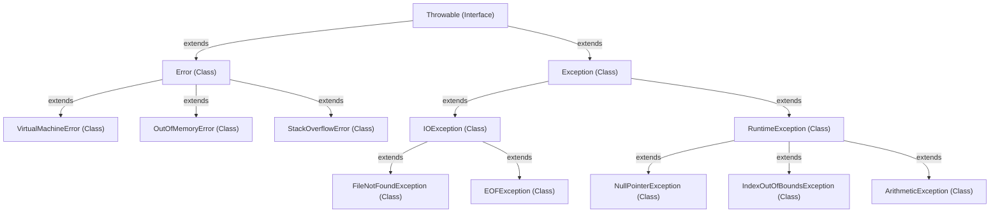

# Exception in Java

An exception in Java is an event that disrupts the normal flow of the program's execution. It can occur due to a variety of reasons, such as invalid input, attempting to divide by zero, file errors, or network issues. When an exception occurs, Java creates an `Exception` object and throws it.


## Types of Exceptions

### 1. **Checked Exceptions**
These are exceptions that must be explicitly handled by the programmer using a `try-catch` block or declared using the `throws` keyword. Examples include `IOException`, `SQLException`.

### 2. **Unchecked Exceptions**
These are exceptions that are not required to be caught or declared thrown. They inherit from `RuntimeException` and include exceptions such as `NullPointerException`, `ArrayIndexOutOfBoundsException`, and `ArithmeticException`.

## Handling Exceptions

### 1. **Try-Catch Block**
It allows you to handle exceptions and prevent the program from crashing.

```java
try {
    // Code that might throw an exception
    int result = 10 / 0; // This will throw ArithmeticException
} catch (ArithmeticException e) {
    // Handle the exception
    System.out.println("Error: " + e.getMessage());
}
```
### 2. **Finally Block**
The finally block is optional and is used for code that must be executed regardless of whether an exception occurred or not, such as closing resources.

```java
try {
    // Code that might throw an exception
} catch (Exception e) {
    // Handle the exception
} finally {
    // Cleanup code
    System.out.println("This will always execute");
}
```

### 3. **Throws Clause**
If a method can throw an exception, you can declare it using the throws keyword.

```java
public void readFile() throws IOException {
    // Code that may throw IOException
}
```

