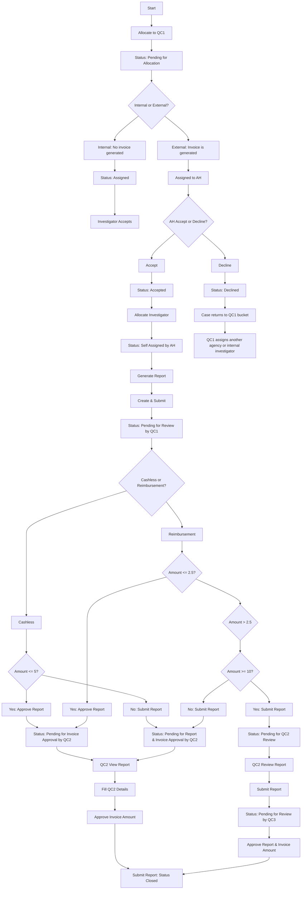

# ILMS Workflow

Here is the flowchart for the ILMS workflow:

```mermaid
graph TD

Start --> QC1[Allocate to QC1]
QC1 --> AllocationStatus[Status: Pending for Allocation]
AllocationStatus --> DecisionInternalExternal{Internal or External?}

DecisionInternalExternal --> Internal[Internal: No invoice generated]
Internal --> Assigned[Status: Assigned]
Assigned --> InvestigatorAccepts[Investigator Accepts]

DecisionInternalExternal --> External[External: Invoice is generated]
External --> AH[Assigned to AH]

AH --> AHDecision{AH Accept or Decline?}
AHDecision --> Accept[Accept]
Accept --> AcceptedStatus[Status: Accepted]
AcceptedStatus --> InvestigatorAllocate[Allocate Investigator]
InvestigatorAllocate --> SelfAssigned[Status: Self Assigned by AH]
SelfAssigned --> GenerateReport[Generate Report]
GenerateReport --> SubmitReport[Create & Submit]
SubmitReport --> QC1Review[Status: Pending for Review by QC1]

AHDecision --> Decline[Decline]
Decline --> DeclinedStatus[Status: Declined]
DeclinedStatus --> ReturnQC1[Case returns to QC1 bucket]
ReturnQC1 --> QC1Reassign[QC1 assigns another agency or internal investigator]

QC1Review --> PaymentDecision{Cashless or Reimbursement?}
PaymentDecision --> Cashless
PaymentDecision --> Reimbursement

Cashless --> CashlessDecision{Amount <= 5?}
CashlessDecision --> ApproveCashless[Yes: Approve Report]
ApproveCashless --> PendingQC2[Status: Pending for Invoice Approval by QC2]
CashlessDecision --> SubmitCashless[No: Submit Report]
SubmitCashless --> PendingQC2Report[Status: Pending for Report & Invoice Approval by QC2]

Reimbursement --> ReimbursementDecision1{Amount <= 2.5?}
ReimbursementDecision1 --> ApproveReimbursement[Yes: Approve Report]
ApproveReimbursement --> PendingQC2[Status: Pending for Invoice Approval by QC2]
ReimbursementDecision1 --> ReimbursementDecision2{Amount > 2.5}
ReimbursementDecision2 --> AmountGreater10{Amount >= 10?}
AmountGreater10 --> SubmitLarge[Yes: Submit Report]
SubmitLarge --> PendingQC2Review[Status: Pending for QC2 Review]
AmountGreater10 --> SubmitSmall[No: Submit Report]
SubmitSmall --> PendingQC2Report[Status: Pending for Report & Invoice Approval by QC2]

PendingQC2 --> QC2Action[QC2 View Report]
QC2Action --> FillQC2[Fill QC2 Details]
FillQC2 --> ApproveInvoice[Approve Invoice Amount]
ApproveInvoice --> Closed[Submit Report: Status Closed]

PendingQC2Report --> QC2Action
PendingQC2Review --> QC2Review[QC2 Review Report]
QC2Review --> SubmitToQC3[Submit Report]
SubmitToQC3 --> QC3Review[Status: Pending for Review by QC3]

QC3Review --> ApproveQC3[Approve Report & Invoice Amount]
ApproveQC3 --> Closed
```