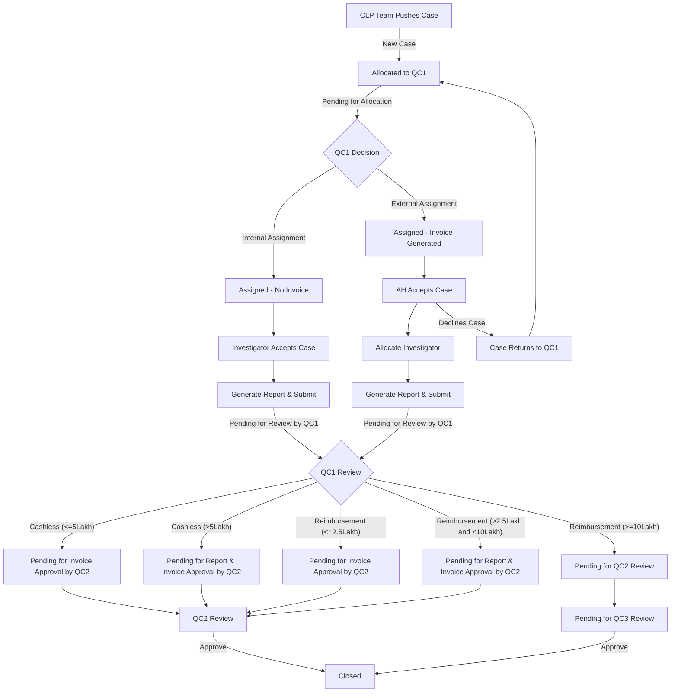

# ILM (Investigation and Loss Mitigation System)

## Overview
The Investigation and Loss Mitigation System (ILMS) is a standalone platform designed to assist the investigation team in conducting systematic and efficient investigations.

## Insurance Policy Lifecycle
The insurance policy lifecycle involves the following key stages:

1. **Pre-Purchase**: Marketing and customer engagement to inform potential clients about available insurance products.
2. **Underwriting**: Assessing the risk associated with the applicant to determine policy terms and premiums.
3. **Issuance**: Creating and delivering the insurance policy document to the policyholder.
4. **Active Management**: Ongoing administration of the policy, including premium collection and handling policy changes.
5. **Claims Management**: Processing and settling claims when the insured event occurs.
6. **Renewal or Termination**: Deciding whether to renew the policy or allow it to expire based on the policyholder's needs and the insurer's policies.

## ILMS Case Management
- The **Claim Legal Platform (CLP) team** triggers all cases into ILMS.
- Cases flowing into ILMS are allocated to the respective **Location State Owner** based on the claim handling location.

### Case Types
1. **New Cases** – Cases triggered from the CLP Team.
2. **Further Investigation** – No success cases requiring more investigation, sent by the CLP Team.
3. **Special Projects** – Previously closed cases marked as genuine but later identified as fraud. These cases are manually uploaded into ILMS in a file format.

## ILMS Services
ILMS provides the following services:
- **Health Investigation Service**
- **Motor TP (Third Party) Service**
- **Motor OD (Own Damage) Service**
- **Workflow Service**
- **Vendor Service**
- **Migration Service**
- **Report Service**
- **Message Service**

## Roles & Responsibilities
| Role | Responsibility |
|------|--------------|
| **QC1** | Location State Owner |
| **QC2** | Regional Manager |
| **QC3** | Central Coordinator |
| **VH** | Vertical Head |
| **ADM** | Admin Controller |
| **INV** | Investigator |
| **AGN** | Agency |
| **AH** | Agency Head |
| **MIS** | MIS & Back Office Manager |
| **ForensicsQC** | Forensic Location State Manager |
| **CAT Doc1** | Chronical Acquisition Team End Doc Collector |
| **CAT Doc2** | Chronical Acquisition Team Internal Doc Collector |
| **CAT QC** | Chronical Acquisition Team Location State Manager |
| **CAT AGN** | Chronical Acquisition Team Agency |

## Technology Stack
- **Backend**: Java 17, Spring Boot 3, PostgreSQL
- **Security & Access Management**: Spring Security, Keycloak
- **API Gateway**: Spring Gateway

## Key Tasks
1. **Case Transfer Feature** – Implement case transfer based on location and role.
2. **Vendor Onboarding** – Develop a structured process for onboarding vendors.
3. **Migration Service** – Enhance migration functionality for seamless data transfer.

# **ILMS Case Workflow**

## **1. CLP Team Pushes Case into ILMS System**
- **Case Status:** **New** → Allocated to **QC1** → **Status:** *Pending for Allocation*
- **QC1 Allocates Case:**
  - **Internal Assignment** (No invoice generated) → **Status:** *Assigned*
  - **External Assignment** (Invoice generated) → **Status:** *Assigned*

---

## **2. Internal Case Workflow**
### **Investigator Process**
1. **Investigator Accepts Case** → **Status:** *Accepted*
2. **Generate Reports** → Fill details → Create & Submit → **Status:** *Pending for Review by QC1*
3. **QC1 Review:**
   - Views reports & fills QC section details
   - Adds invoice-approved amount
   - Determines if the case is **Cashless** or **Reimbursement**

### **Cashless Process**
- **If Amount ≤ ₹5 lakh** → Approve Report → **Status:** *Pending for Invoice Approval by QC2*
- **If Amount > ₹5 lakh** → Submit Report → **Status:** *Pending for Report & Invoice Approval by QC2*

### **Reimbursement Process**
- **If Amount ≤ ₹2.5 lakh** → Approve Report → **Status:** *Pending for Invoice Approval by QC2*
- **If Amount > ₹2.5 lakh but < ₹10 lakh** → Submit Report → **Status:** *Pending for Report & Invoice Approval by QC2*
- **If Amount ≥ ₹10 lakh** → Submit Report → **Status:** *Pending for QC2 Review*

---

## **3. QC2 Review**
- **For "Pending for Invoice Approval by QC1" or "Pending for Report & Invoice Approval by QC1"**
  - Approve Report
  - View report & fill QC2 section details
  - Approve invoice amount
  - Submit report → **Status:** *Closed*

- **For "Pending for QC2 Review"**
  - View report & fill QC2 section details
  - Submit report → **Status:** *Pending for Review by QC3*

---

## **4. QC3 Review (If Applicable)**
- Approve Report
- Approve Invoice Amount
- **Status:** *Closed*

---

## **5. External Case Workflow**
### **AH Process**
1. **AH Accepts Case** → **Status:** *Accepted*
2. **Allocate Investigator** → **Status:** *Self Assigned by AH*
3. **Generate Reports** → Fill details → Create & Submit → **Status:** *Pending for Review by QC1*
4. **Follows Same QC1 → QC2 → QC3 Review Process as Internal Cases**

### **If AH Declines Case**
- **Status:** *Declined*
- Case returns to QC1 bucket
- QC1 reassigns to another agency or internal investigator

