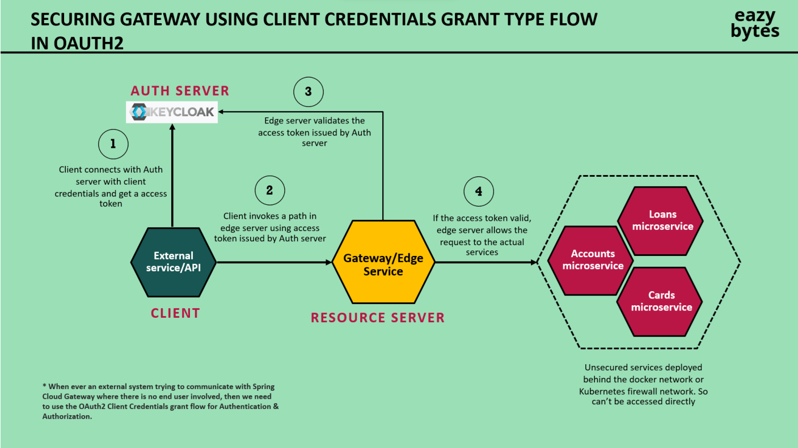

# Keycloak as Resource Server in Spring Boot Application

## 1. Keycloak Setup

### Realm:
- Create a realm in Keycloak for your application (e.g., `myapp-realm`).

### Client:
- Add a new client in the Keycloak realm (e.g., `spring-boot-client`).
- Configure the client to use public client access.
- Set the **Valid Redirect URI** to the correct URL of your Spring Boot app (e.g., `http://localhost:8080/*`).

### Roles:
- Create roles like `ACCOUNTS`, `CARDS`, and `LOANS` in the Keycloak realm.
- Assign these roles to users based on their permissions.

---

## 2. Spring Boot Security Configuration (Resource Server)

In this part, Spring Security is configured to act as a resource server that validates JWT tokens issued by Keycloak.

### 2.1 Dependencies:
Add the following dependencies to your `pom.xml` to integrate Spring Security and Keycloak:

```xml
<dependency>
    <groupId>org.keycloak</groupId>
    <artifactId>keycloak-spring-boot-starter</artifactId>
    <version>YOUR_KEYCLOAK_VERSION</version>
</dependency>
<dependency>
    <groupId>org.springframework.boot</groupId>
    <artifactId>spring-boot-starter-oauth2-resource-server</artifactId>
</dependency>
```
## 2.2 Application Properties Configuration:
In application.properties (or `application.yml`), configure Keycloak settings:
```properties
keycloak.realm=myapp-realm
keycloak.auth-server-url=http://localhost:8080/realms/myapp-realm
keycloak.public-client=true
keycloak.resource=spring-boot-client
keycloak.credentials.secret=YOUR_SECRET
spring.security.oauth2.resourceserver.jwt.issuer-uri=http://localhost:8080/realms/myapp-realm
```

## 3. Security Configuration Class
Create a SecurityConfig class to define resource server settings and JWT validation.

## 3.1 SecurityConfig Class:
** Before Spring 5 **
```java
@Configuration
@EnableWebSecurity
public class SecurityConfig extends WebSecurityConfigurerAdapter {

    @Override
    protected void configure(HttpSecurity http) throws Exception {
        http
            .oauth2ResourceServer()
            .jwt()
            .and()
            .authorizeRequests()
            .antMatchers("/accounts/**").hasRole("ACCOUNTS")
            .antMatchers("/cards/**").hasRole("CARDS")
            .antMatchers("/loans/**").hasRole("LOANS")
            .anyRequest().authenticated();
    }
}
```

** Before Spring 5 **
```java
@Configuration
@EnableWebSecurity
public class SecurityConfig {

    @Bean
    public SecurityFilterChain securityFilterChain(HttpSecurity http) throws Exception {
        http
            .oauth2ResourceServer()
            .jwt()
            .and()
            .authorizeRequests()
            .antMatchers("/accounts/**").hasRole("ACCOUNTS")
            .antMatchers("/cards/**").hasRole("CARDS")
            .antMatchers("/loans/**").hasRole("LOANS")
            .anyRequest().authenticated();
        return http.build();
    }
}

```
### Role-Based Access Control:
Here, we restrict access to certain URLs based on the roles (ACCOUNTS, CARDS, LOANS) defined in Keycloak.

### JWT Converter:
JwtAuthenticationConverter is used to extract roles from the JWT token and map them to Spring Security's authorities.

## 4. JWT Token Validation
Spring Security validates the JWT token by using Keycloak’s public key endpoint, typically at:
`http://localhost:8080/realms/myapp-realm/protocol/openid-connect/certs`

This URL exposes Keycloak's public keys used for validating the JWT signatures.

## 5. Role Mapping (Keycloak Role Converter)
You need to map the roles from Keycloak's JWT into Spring Security roles. You can do this with a custom Converter<Jwt, AbstractAuthenticationToken>.

## 5.1 KeycloakRoleConverter:
```java 
public class KeycloakRoleConverter implements Converter<Jwt, AbstractAuthenticationToken> {

    @Override
    public AbstractAuthenticationToken convert(Jwt jwt) {
        List<GrantedAuthority> authorities = extractRoles(jwt);
        return new JwtAuthenticationToken(jwt, authorities);
    }

    private List<GrantedAuthority> extractRoles(Jwt jwt) {
        Collection<String> roles = (Collection<String>) jwt.getClaims().get("realm_access").get("roles");
        return roles.stream()
                    .map(role -> new SimpleGrantedAuthority("ROLE_" + role))
                    .collect(Collectors.toList());
    }
}
```
This class maps Keycloak roles from the realm_access claim in the JWT to Spring Security's granted authorities (prefix ROLE_ added).

## 6. Disabling CSRF Protection
Since this is a stateless application using JWT, CSRF protection is not needed and can be disabled:
```java 
http.csrf().disable();
```
## 7. Security Flow
### Client Authentication:
A client authenticates with Keycloak and obtains a JWT token.
### JWT Token Transmission:
The client includes the JWT token in the Authorization header (Bearer <jwt_token>) in its API requests.
### JWT Validation:
Spring Boot's SecurityConfig class validates the token using the public keys from Keycloak.
### Role-based Authorization:
Based on the roles embedded in the JWT (via realm_access claim), the resource server enforces access control to various APIs.
## 8. Token Expiry and Refresh
Keycloak issues short-lived JWT tokens, and the client may need to refresh the token when expired. This can be done using a refresh token, which is also handled by Keycloak.


